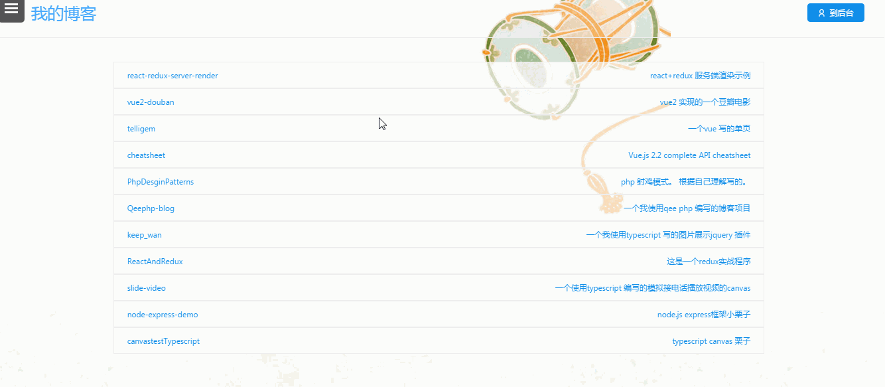
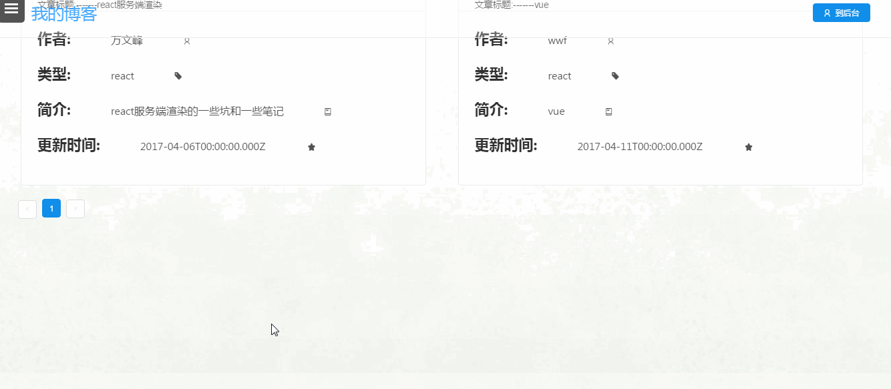
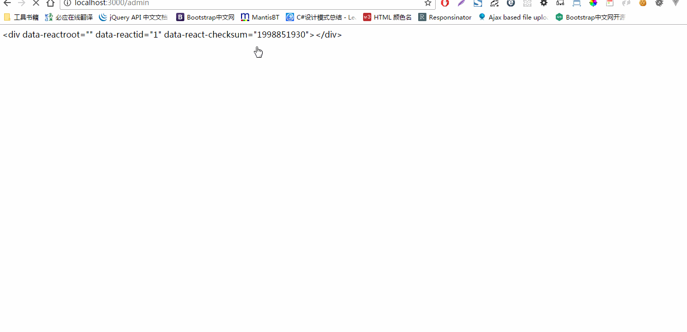
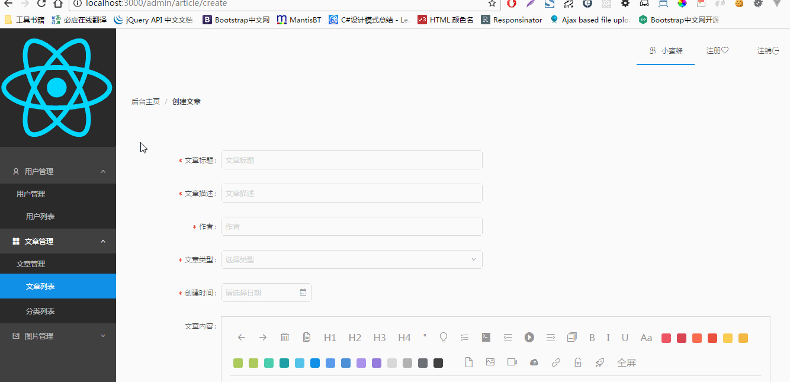
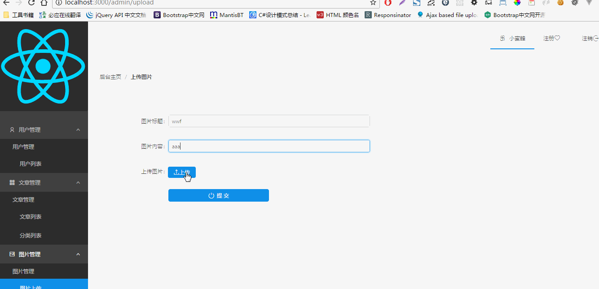

# react-blog
这是一个使用react+redux完成的全家桶bolg 项目,服务端渲染; 后台框架使用node.js 的express 框架,数据库使用的是mongodb,大量使用es6 语法。
和async await 语法;
性能之类的我没去优化;
另外由于我数据库是短板希望大家轻拍;
有许多bug .由于这个项目后期不会再进行维护了。所以这些bug 我也不会去修复。有些地方样式我也没仔细去搞。组件复用和组件优化也没做; 本人现在在做个旅游项目，这个项目就给各位参考下吧。希望能对大家有点帮助。  
其中有许多我踩过的坑. 
### 这个项目完全是基于react+react-router+redux做的。没有一点jq 代码。 因为本人实在不喜欢jq
几个已知的bug
1. 后台 只有首页能刷新。  其余页面刷新会报404错误; 
2. 图片上传会偶尔中断node.js   http 服务.但是数据和图片还是保存了和上传成功了。
3. 有些插件内不能引入css 否为会报css 无法加载。  目前解决方案是在客户端入口 定位 #app 渲染那个文件import 就不会报错; 
## 安装
npm install 或yarn
## 运行
npm start -s
## 检查node 版本
npm run preinstall
## 编译生产版本
npm run build
## 测试 与监听测试
npm run test:watch  || npm run test
## 检测代码规范 或监听检测代码规范
npm run lint || npm run lint:watch
## 清理编译后的文件夹 和 删除编译的文件
npm run clean-dist || npm run remove-dist
## 使用的技术栈 和依赖组件作用
1. node.js 版本 6.X以上
2. mongoose(mongodb 连接操作工具)
3. express(Node.js 框架)
4. react (版本15.4)
5. redux(状态管理)
6. webpack (打包工具 2.X 版本)
7. draft-js (react 富文本依赖)
7.1 immutable (数据不可变库),
7.2 js-base (富文本组件依赖的解析图片)
8. passport (node.js 密码验证)
9. passport-local (密码验证策略)
9.1 passport-jwt (令牌验证)
9.2 jwt-simple (服务端发送令牌给客户端)
10. webpack-dev-middleware(开发环境编译中间件)
11. webpack-hot-middleware(热加载中间件)
12. antd (一个阿里react ui库)
13. axios (ajax 客户端请求库,作用类似jquer 的ajax)
14. body-parser (body 解析中间件)
15. lodash (工具函数包)
16. classnames (一个管理“类”组件)
17. pugjs (html 模板引擎)
18. multer (上传文件中间件)
19. react-dom (react 虚拟dom节点渲染)
20. react-image (react 一个点击预览组件)
21. react-photo-gallery (响应式图片管理组件)
22. react-redux (连接react 和redux)
23. react-router (react 路由)
24. react-router-redux (redux 异步路由系统)
25. redux-form (redux 表单组件。提供了验证。等等强大功能)
26. redux-thunk (redux 异步组件)
27. object-assign (es6 对象分配)
28. synthetic-dom (富文本组件依赖)
##  编译组件
27. autoprefixer (识别css 头 如-webkit-)
28. babel-cli (babel 命令行)
29. babel-core (babel 核心)
30. babel-eslint (babel 代码规范检测)
31. babel-loader (babel 装载)
32. babel-plugin-import (babel import 引入)
33. babel-plugin-react-display-name (添加显示名字给react.cerateClass)
34. babel-plugin-transform-react-constant-elements (添加转换 jsx 节点支持)
35. babel-plugin-transform-react-remove-prop-types (添加转换 jsx 属性支持)
36. babel-preset-es2015 (es6 转码支持)
37. babel-preset-latest (预置 babelrc 里面支持最新的es5 es6 es7)
38. babel-preset-react (预置 babelrc 里面支持 react)
39. babel-preset-stage-1 (es7 语法候选版1)
40. babel-register (对node.js 的require 勾子)
41. chai (测试库)
42. chalk (命令行颜色显示组件)
43. compression (文件压缩工具)
44. cross-env (跨平台命令行工具,  可以运行一些unix 命令)
45. css-loader (css 装载器)
46. enzyme (react 测试工具 可以模拟jqery dom 循环遍历)
47. eslint (代码规范验证)
48. eslint-plugin-import (代码引入规范验证)
49. eslint-plugin-jsx-ally (代码 jsx 语法规范验证)
50. eslint-plugin-react (react 规范验证)
51. eslint-watch (验证监听)
52. extract-text-webpack-plugin (将文本从包中提取到文件中。)
53. file-loader (文件加载器)
54. json-loader (json 加载器)
55. mocha (测试工具)
56. node-sass (支持编译sass)
57. npm-run-all (运行所有npm 脚本)
58. open (运行后代开浏览器)
59. postcss-loader (支持scss 加载器)
60. react-addons-test-utils (react 原生测试工具)
61. react-hot-loader (react热加载工具)
62. redux-immutable-state-invariant (检测突变的redux 状态。仅仅用于开发环境)
63. rimraf (unix 命令行)
64. sass-loader(sass 加载器)
65. sinon (独立的测试框架)
66. sinon-chai (测试工具)
67. style-loader (样式加载器)
68. url-loader (图片，字体加载器)
######这个例子使用的是传统的mvc 结构   借鉴了很多别人的经验
## 截图

